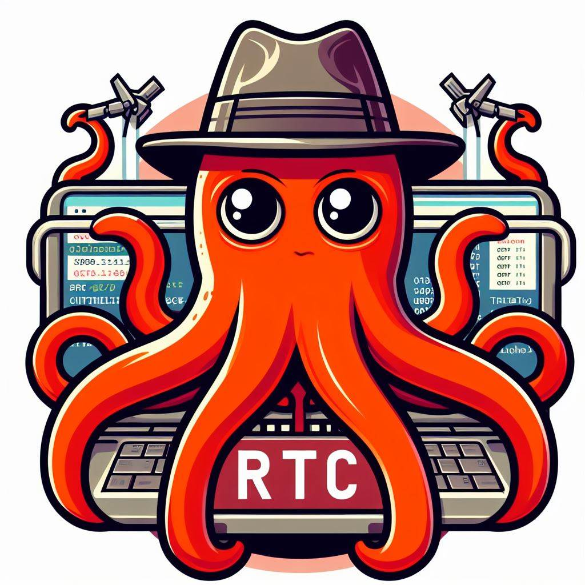

<a name="readme-top"></a>

[![Contributors][contributors-shield]][contributors-url]
[![Forks][forks-shield]][forks-url]
[![Stargazers][stars-shield]][stars-url]
[![Issues][issues-shield]][issues-url]
[![MIT License][license-shield]][license-url]

<br />
<div align="center">
  <a href="https://github.com/EmPierrain/RTC">
    
  </a>

<h3 align="center">Red Team Container</h3>

  <p align="center">
    Home made container for Red Teaming
    <br />
    <br />
    <a href="https://github.com/EmPierrain/RTC">View Demo</a>
    ·
    <a href="https://github.com/EmPierrain/RTC/issues">Report Bug</a>
    ·
    <a href="https://github.com/EmPierrain/RTC/issues">Request Feature</a>
  </p>
</div>


<details>
  <summary>Table of Contents</summary>
  <ol>
    <li><a href="#about-the-project">About The Project</a></li>
    <li>
      <a href="#getting-started">Getting Started</a>
      <ul>
        <li><a href="#prerequisites">Prerequisites</a></li>
        <li><a href="#installation">Installation</a></li>
      </ul>
    </li>
    <li><a href="#usage">Usage</a></li>
    <li><a href="#license">License</a></li>
    <li><a href="#contact">Contact</a></li>
  </ol>
</details>


## About The Project

This project compile some tools for LEGAL Red Teaming in a single Docker container. 

Disclaimer: I am not responsible for any legal issue you may encounter. This tool is only for educational purposes and should never be used in any illegal situation.

<p align="right">(<a href="#readme-top">back to top</a>)</p>


## Getting Started

To get a local copy up and running follow these simple example steps.

### Prerequisites

To run this project, you need Docker and its components installed. [Here is a link to a guide how to install docker easily](https://docs.docker.com/engine/install/ubuntu/).

### Installation

Everything is almost ready to be run. You just need to built the solution and run it with Docker commands as follow:

1. Clone the repo
   ```sh
   git clone https://github.com/EmPierrain/RTC.git
   ```
   
2. Build the docker container
   ```sh
   docker build -t empierrain:rtc .
   ```
   
3. Run the container
   ```sh
   docker compose up -d
   ```

<p align="right">(<a href="#readme-top">back to top</a>)</p>

## Usage

Use this space to show useful examples of how a project can be used. Additional screenshots, code examples and demos work well in this space. You may also link to more resources.

_For more examples, please refer to the [Documentation](https://example.com)_

<p align="right">(<a href="#readme-top">back to top</a>)</p>


## License

Distributed under the GNU GPLv3 License. See `LICENSE.txt` for more information.

<p align="right">(<a href="#readme-top">back to top</a>)</p>


## Contact

Project Link: [https://github.com/EmPierrain/RTC](https://github.com/EmPierrain/RTC)

<p align="right">(<a href="#readme-top">back to top</a>)</p>


[contributors-shield]: https://img.shields.io/github/contributors/EmPierrain/RTC?style=for-the-badge
[contributors-url]: https://github.com/EmPierrain/RTC/graphs/contributors
[forks-shield]: https://img.shields.io/github/forks/EmPierrain/RTC.svg?style=for-the-badge
[forks-url]: https://github.com/EmPierrain/RTC/network/members
[stars-shield]: https://img.shields.io/github/stars/EmPierrain/RTC.svg?style=for-the-badge
[stars-url]: https://github.com/EmPierrain/RTC/stargazers
[issues-shield]: https://img.shields.io/github/issues/EmPierrain/RTC.svg?style=for-the-badge
[issues-url]: https://github.com/EmPierrain/RTC/issues
[license-shield]: https://img.shields.io/github/license/EmPierrain/RTC.svg?style=for-the-badge
[license-url]: https://github.com/EmPierrain/RTC/blob/master/LICENSE.txt
